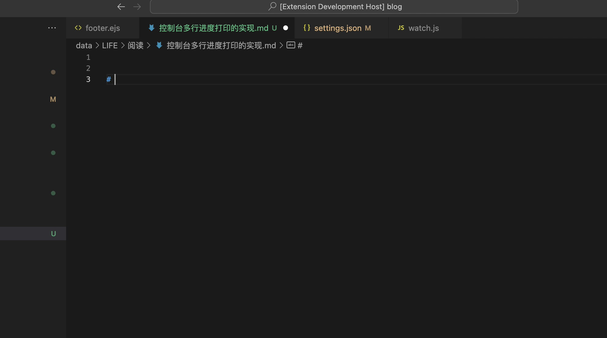

# 自用 vscode 工具插件

包含单词翻译功能，转换`json`字符串到`typescript interface`。

1. 选中单词过，右键`mytool->translate`，自动替换为对应的中文。
2. 在`js`、`ts`、`json`文件中选中`json`对象，右键`mytool->json2ts`，会把选中的字符串替换为`typescript interface`字符串。

## 演示图

1. 单词翻译功能

2. 转换 `json` 字符串为 `typescript interface`

3. 在保存 `markdown` 时自动添加一些有用的头信息，可以通过 `"mytools-zack.autoAddMetaToMarkdown": true` 来进行关闭和打开
